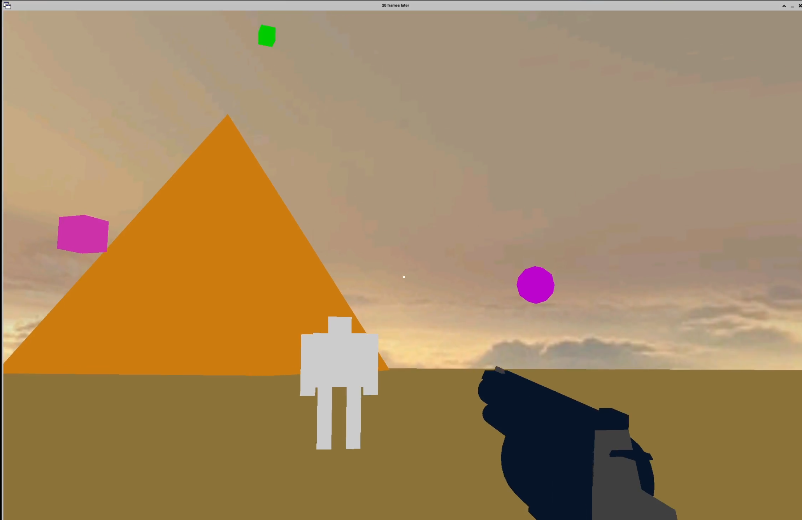

# 28 Frames Later 

Currently in active development phase, hoping to have a playable crossplatform demo before thanksgiving.
To play the game just git clone or download the repository then execute the binary (a.out) or compile for your platform of choice.
I only plan to support mouse and keyboard peripherals but SDL2 can support controlers/joy sticks/etc. so feel free to diy :)
Contact me for tech support, bug reports, feature suggestions in my tiktok DMs @h4z3_th3_sk1d

demo todo:
any map that isn't a box/pit
dead zombies drop guns, ammo, items

todo:
refactor object loader and add texture support (impossible)
use SDL2 to render text for a menu/HUD
mutliplayer
map selection menu and graphics settings menu

todo maps:
shopping mall map
paris, France (effiel tower, arc de triomphe,the louvre)

todo guns:
kalashnikov (customizable and full auto)
.40 s&w block 23 (semi but can be customized to full auto ;)
fgc 9mm

todo items:
shinigami eyes item
fragmentation grenade
jump boost
speed boost
armour
horcrux (placeable personal respawn point)
resuscitation/resurrection charm

todo melee:
knife
longsword

todo voice:
"truely, the ugliest people do the prettiest things"

based off of "FPS game (C++, OpenGL, SDL)" on youtube by "thecplusplusguy" 
tutorial playlist: https://youtube.com/playlist?list=PLA850388B1C9C62A6&si=vKluvRxL3d5AJ3Hj
credit to: https://www.youtube.com/@thecplusplusguy

Luke 22:36-38
Then said he unto them, But now, he that hath a purse, let him take it, and likewise his scrip: and he that hath no sword, let him sell his garment, and buy one. For I say unto you, that this that is written must yet be accomplished in me, And he was reckoned among the transgressors: for the things concerning me have an end.
And they said, Lord, behold, here are two swords.
And he said unto them, It is enough.

"even the best weapon
is an unhappy tool,
hateful to living things."
-Lao Tzu (translated by Ursula K. Le Guin)
